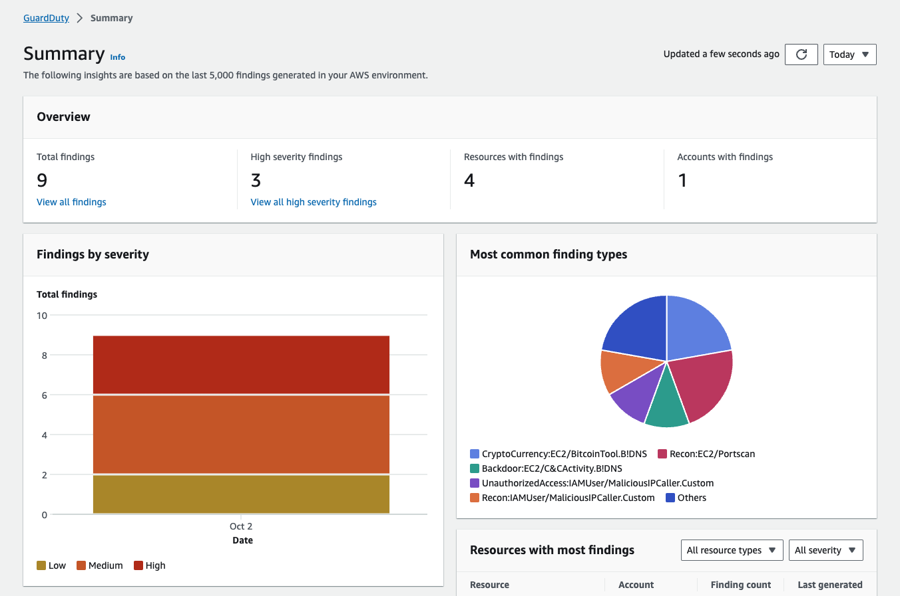
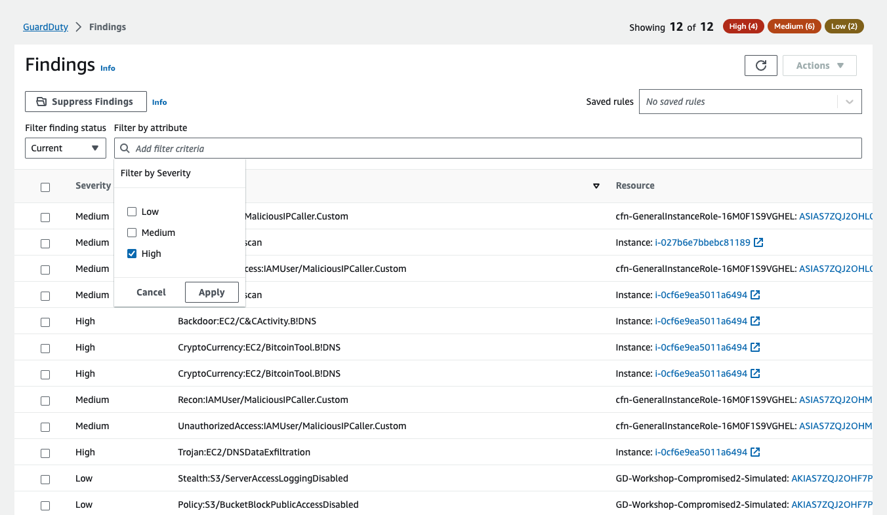
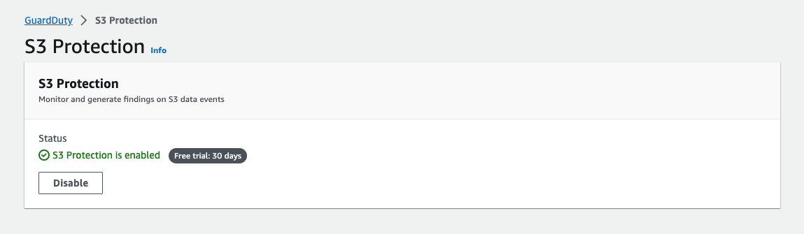
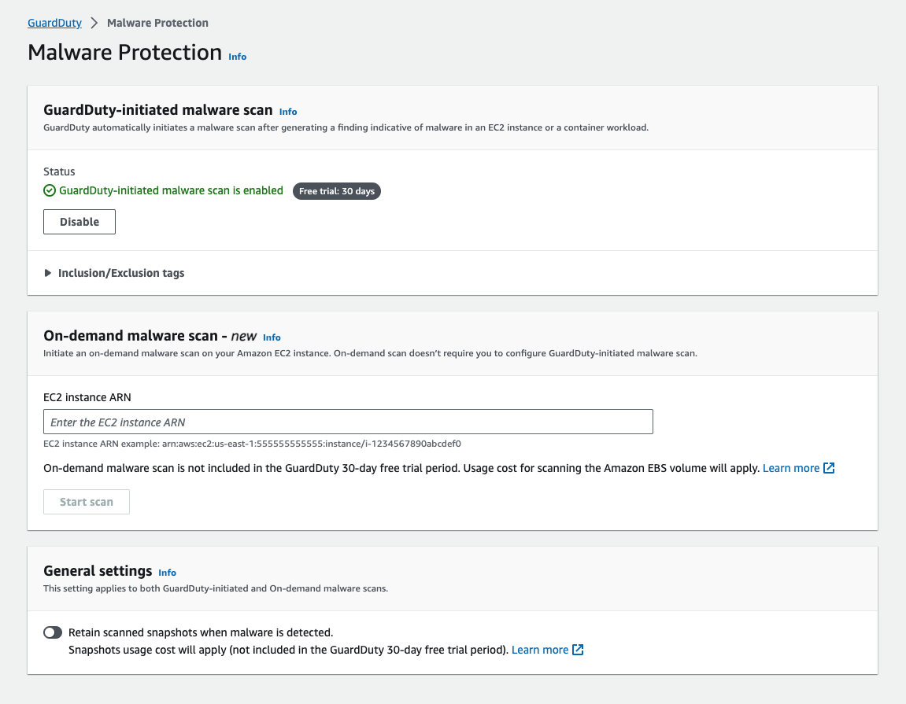

Amazon GuardDuty cung cấp khả năng phát hiện mối đe dọa cho phép bạn liên tục giám sát và bảo vệ account AWS, workloads và dữ liệu được lưu trữ trong Amazon S3. GuardDuty phân tích các metadata streams liên tục được tạo từ account của bạn và network activity được tìm thấy trong AWS CloudTrail Events, VPC Flow Logs, và DNS Logs. GuardDuty cũng sử dụng thông tin tình báo về mối đe dọa tích hợp như địa chỉ IP độc hại, phát hiện bất thường, machine learning để xác định chính xác hơn các mối đe dọa. 

GuardDuty hoạt động hoàn toàn độc lập với resource của bạn, do đó không có nguy cơ ảnh hưởng đến hiệu suất hoặc tính khả dụng đối với workload của bạn. Service này được quản lí hoàn toàn với thông tin về mối đe dọa tích hợp, phát hiện bát thường và machine learning. Amazon GuardDuty cung cấp các cảnh báo chi tiết và hữu ích, dễ dàng tích hợp các hệ thống quy trình làm việc và quản lí event hiện có. Không có chi phí trả trước và bạn chỉ phải trả tiền cho các event được phân tích mà không cần phải có phần mềm bổ sung để deploy hoặc đăng kí nguồn cấp dữ liệu thông tin về các mối đe dọa.

{}
GuardDuty đã được kích hoạt khi chạy CloudFormation
{}

#### Amazon GuardDuty

Đến trang [Amazon GuardDuty](https://ap-southeast-1.console.aws.amazon.com/guardduty/home?region=ap-southeast-1#/), chúng ta sẽ thấy trang **Summary** cung cấp tổng quan và trực quan về các findings trong account của bạn.

Mở trang **Findings**, nó sẽ hiển thị các findings trong account này. GuardDuty finding thể hiện một vấn đề bảo mật tiềm ẩn được phát hiện trong network của bạn. GuardDuty đưa ra finding bất cứ khi nào phát hiện thấy hoạt động bất ngờ và có khả năng gây hại trong môi AWS environment của bạn.

#### Tìm kiếm và lọc GuardDuty Findings

Bộ lọc findings cho phép bạn xem các findings phù hợp với tiêu chí bạn chỉ định và lọc ra mọi findings chưa khớp. Bộ lọc findings có thể được tạo và kiểm tra thông qua GuardDuty console. Bạn có thể lưu lại các filters được tạo thông qua console để sử dụng trong các quy tắc loại bỏ hoặc các hoạt động filter trong tương lai. Filter được tạo thành từ ít nhất một tiêu chí lọc, bao gồm một filter attribute được ghép nối với ít nhất một giá trị.

Click vào thanh tìm kiếm, nhập **Severity** và click chọn nó, nó sẽ mở ra menu nhỏ với lựa chọn **Low**, **Medium**, **High**. Check vào **High** và click **Apply**, nó sẽ cập nhật nhưng findings tương ứng.

#### Giá của Amazon GuardDuty

Các tier price của GuardDuty bao gồm foundational pricing, là mức giá mặc định của phạm vi service, cũng như giá của các gói bảo vệ tùy chọn. Khi kích hoạt GuardDuty lần đầu tiên, bạn sẽ tự động bật các biện pháp bảo vệ cơ bản và gói bảo vệ tùy chọn, ngoại trừ tính năng Amazon EKS Runtime Monitoring có thể được kích hoạt riêng. Mặc dù bạn có thể tắt mọi tính năng bảo vệ tùy chọn bất kì lúc nào, nhưng các biện pháp bảo vệ cơ bản là bắt buộc đối với các tài khoản kích hoạt GuardDuty. Service logs được phân tích, được lọc để tối ưu hóa chi phí và được tích hợp trực tiếp với GuardDuty, nghĩa là bạn không cần phải kích hoạt hoặc thanh toán riêng cho chúng.

Giá thay đổi tùy theo data source và region, đồng thời có thể thay đổi khi log sources mới được giới thiệu và log sources hiện có được tối ưu hóa để giảm chi phí và log volumes tặng giảm tùy theo hoạt động liên quan đến workload khác nhau của bạn trong AWS.

Bạn có thể sử dụng GuardDuty console hoặc API operation để ước tính chi phí sử dụng trung bình hàng ngày cho GuardDuty. Trong thời gian dùng thử miễn phí 30 ngày, ước tính chi phí sẽ dự đoán chi phí ước tính của bạn sau thời gian dùng thử. Nếu bạn đang hoạt động trong môi trường nhiều account, adminitrator account GuardDuty của bạn có thể giám sát số liệu chi phí cho tất cả các member accounts.

{}
Ở các Region được hỗ trợ, chủ account GuardDuty mới có thể dùng thử dịch vụ miễn phí trong 30 ngày và có quyền truy cập vào tất cả các tính năng (Bản dùng thử miễn phí Malware Protection chỉ khả dụng chi quá trình quét do GuardDuty khởi tạo) và phát hiện cac findings. GuardDuty console cho biết số ngày dùng thử miễn phí còn lại cũng như chi phí trung bình hàng ngày (dựa trên khối lượng data được phân tích và quét), giúp bạn không phải phỏng doán khi lập kế hoạch ngân sách.
{}

Ở thanh điều hướng bên trái, click vào **Usage**. Các ước tính được hiển trị trong GuardDuty console có thể khác một chút so với ước tính trong AWS Billing and Cost Mangagement console. Để biết thêm thông tin, [xem ở đây](https://docs.aws.amazon.com/guardduty/latest/ug/monitoring_costs.html).

#### Retaining GuardDuty Findings

Các security findings được lưu giữ và cung cáp thông qua GuardDuty console và API trong 90 ngày. Sau 90 ngày, findings sẽ bị loại bỏ. Để lưu giữ các findings lâu hơn 90 ngày, bạn có thể kích hoạt EventBridge để tự động đẩy các findings đến Amazon S3 bucket trong account của bạn hoặc một kho dữ liệu khác để lưu trữ lâu dài.

GuardDuty hỗ trợ xuất các findings đang hoạt động sang CloudWatch Events và tùy chọn, sang Amazon S3 bucket. Các findings mới active mà GuardDuty tạo ra sẽ tự động được xuất trong vòng khoảng 5 phút sau khi findings được tạo. Bạn có thể đặt tuần suất xuất các bản cập nhật cho các active finding sang CloudWatch Events. Tần suất bạn chọn sẽ áp dụng cho việc xuất các lần xuất hiện mới của các findings hiện có sang CloudWatch Events, S3 bucket của bạn (nếu được config) và detective (nếu được tích hợp).

#### Amazon S3 protection trong Amazon GuardDuty

Tính năng bảo vệ S3 cho phép Amazon GuardDuty giám sát các hoạt động object-level API để xác định các rủi ro bảo mật tiềm ẩn đối với dữ liệu trong S3 bucket của bạn.

GuardDuty giám sát các mối đe dọa đối với resource Amazon S3 của bạn bằng cách phân tích các sự kiện quản lí AWS CloudTrail và các data event CloudTrail S3. Các nguồn dữ liệu này giám sát các loại hoạt động khác nhau, ví dụ: các event management CloudTrail cho S3 bao gồm các hoạt động liệt kê hoặc configure các S3 buckets chẳng hạn như ListBuckets, DeleteBuckets và PutBucketReplication. Ví dụ về sự kiện dữ liệu cho S3 bao gồm các hoạt động object-level API, chẳng hạn như GetObject, ListObjects, DeleteObject và PutObject.

Theo mặc định, tính năng giám sát GuardDuty đối với các sự kiện quả lí CloudTrail được bật cho tất cả các tài khoản đã bật GuardDuty và không thể config được. CloudTrail S3 data event logs là nguồn dữ liệu có thể config trong GuardDuty. Theo mặc định, tính năng bảo vệ S3 được bật cho các trình phát hiện mới, đối với các account được tạo trước khi bổ sung tính năng bảo vệ S3, nguồn dữ liệu này phải được bật theo cách thủ công. Các quy trình bật hoặc tắt tính năng giám data event S3 sẽ được đề cập trong chủ đề này.

Chúng tôi khuyên bạn nên bật tính năng bảo vệ S3 trong GuardDuty. Nếu tính năng này bị tắt, GuardDuty không thể giám sát đầy đủ hoặc tạo ra các phát hiện về hoạt động truy cập đáng ngờ vào dữ liệu được lưu trữ trong S3 bucket của bạn.

Để đảm bảo S3 Protection được kích hoạt, ở trang console, click vào **S3 Protection** dưới **Protection plans** ở thanh điều hướng bên trái. Xác nhận lại nó đã được **enabled**.

#### Malware Protection trong Amazon GuardDuty

Malware Protection giúp bạn phát hiện sự tiềm ẩn của phần mềm độc hại bằng cách quét các Amazon EBS được đính kèm với các Amazon EC2 instances và container workloads. Malware Protection cung cấp các tùy chọn quét để bạn có thể quyết định xem mình muốn bao gồm hay loại trừ các Amazon EC2 instance cụ thể và container workloads tại thời điểm quét. Nó cũng cung cấp tùy chọn để giữ lại snapshot của các Amazon EBS được đính kèm với các Amazon EC2 instances hoặc container workloads trong tài khoản GuardDuty của bạn. Snapshots chỉ được giữ lại khi tìm thấy phần mềm độc hại và tạo ra Malware Protection findings.

Malware Protection cung cấp hai loại quét để phát hiện hoạt động độc hại tiềm ẩn trong các Amazon EC2 instances và container workloads của bạn – quét phần mềm độc hại do GuardDuty khởi tạo và quét phần mềm độc hại theo yêu cầu.

Để đảm bảo Malware Protection được kích hoạt, ở trang console, click vào **Malware Protection** dưới **Protection plans** ở thanh điều hướng bên trái. Xác nhận lại nó đã được **enabled**.

#### RDS Protection in Amazon GuardDuty

RDS Protection trong Amazon GuardDuty phân tích và lập profile login activity RDS để phát hiện các mối đe dọa truy cập tiềm ẩn vào cơ sở dữ liệu Amazon Aurora của bạn (Amazon Aurora MySQL-Compatible Edition và Aurora PostgreSQL-Compatible Edition). Tính năng này cho phép bạn xác định hành vi đăng nhập đáng ngờ. RDS Protection không yêu cầu cơ sở hạ tầng bổ sung, nó được thiết kế để không ảnh hưởng đến hiệu suất của các database instances của bạn.

Khi RDS Protection phát hiện một nỗ lực đăng nhập bất thường hoặc đáng ngờ tiềm ẩn cho thấy mối đe dọa đối với cơ sở dữ liệu của bạn, GuardDuty sẽ tạo ra một findings mới cùng với các chi tiết về cơ sở dữ liệu có khả năng bị xâm phạm.

Bạn có thể bật hoặc tắt tính năng RDS Protection cho bất kỳ tài khoản nào ở bất kỳ AWS Region nào có tính năng này trong Amazon GuardDuty bất kỳ lúc nào.

Để đảm bảo RDS Protection được kích hoạt, ở trang console, click vào **RDS Protection** dưới **Protection plans** ở thanh điều hướng bên trái. Xác nhận RDS Login Activity Monitoring đã được **enabled**.