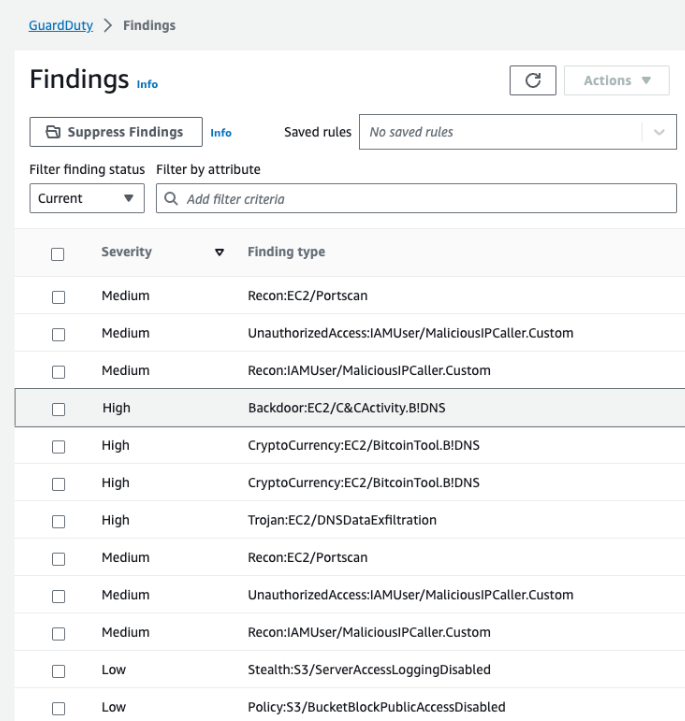
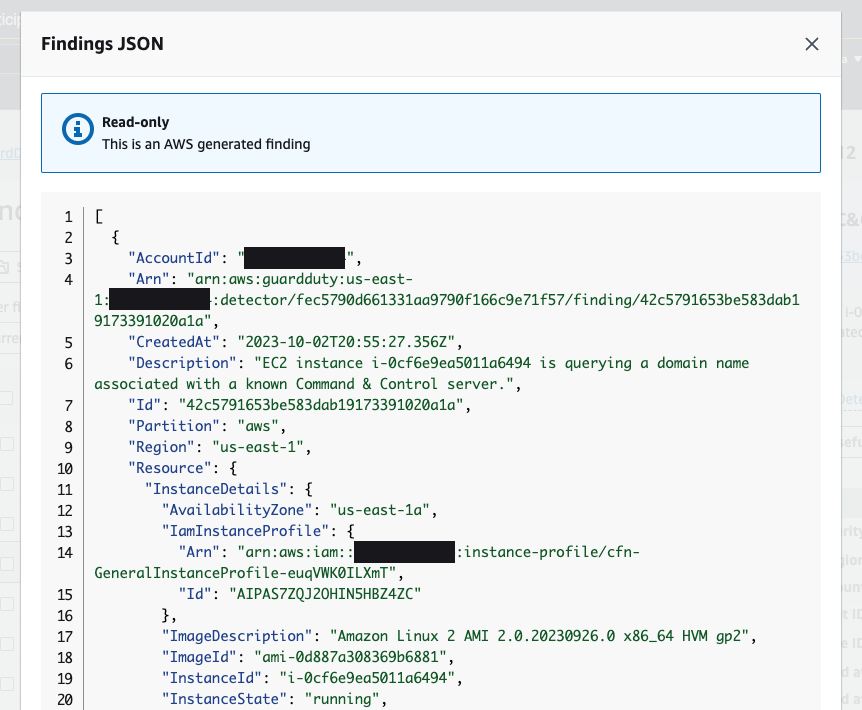

Ở phần trước, finding của GuardDuty thể hiện một vấn đề bảo mật tiềm ẩn được phát hiện trong network của bạn. GuardDuty đưa ra finding bất cứ khi nào nó thấy hoạt động bất ngờ và có khả năng gây hại trong AWS environment của bạn. Bạn có thể xem và quản lý các findings của GuardDuty trên trang **Findings** trong GuardDuty console hoặc bằng cách sử dụng các API operations hoặc GuardDuty CLI.

Trong Amazon GuardDuty, ở thanh điều hướng bên trái, click vào **Findings**. Chọn một trong những finding trên trang. Nó sẽ mở ra tóm tắt của finding đó ở phần bên phải của trang. Chi tiết của finding dựa vào loại finding.

#### Tìm hiểu GuardDuty finding severity

Amazon GuardDuty cung cấp ba severity levels (Low, Medium và High) để giúp khách hàng ưu tiên ứng phó trước các mối đe dọa tiềm ẩn. “Low” severity level cho biết hoạt động đáng ngờ hoặc độc hại đã bị chặn trước khi xâm phạm resource của bạn. “Medium” severity level cho biết hoạt động đáng ngờ. Ví dụ: một lượng lớn lưu lượng truy cập được trả về máy chủ từ xa đang ẩn sau Tor network hoặc hoạt động đi chệch khỏi hành vi thường được quan sát. "Cao" severity level cho biết resource được đề cập (ví dụ: EC2 instance hoặc tập hợp IAM user credentials) đã bị xâm phạm và đang được sử dụng cho các mục đích trái phép.

Nếu bạn muốn xem và tải về finding với JSON form, click vào **Finding ID** ở phần trên.

#### Quản lí các GuardDuty findings

Bạn cũng có tùy chọn archiving, exporting và unarchiving các findings. Việc archiving một finding sẽ lưu và dừng cảnh báo về finding đó. Exporting finding cho phép tải xuống finding hoàn chỉnh có định dạng JSON. Unarchiving một finding sẽ ngược lại với archiving. Chọn một finding bằng cách click vào checkbox bên cạnh finding.

Với finding đã chọn, hãy click vào **Action** để hiện danh sách các action. Click vào "Archive" để lưu trữ finding.

Việc lưu trữ finding sẽ ẩn nó khỏi danh sách các finding hiện tại. Để xem nó, hãy click vào **Current** để hiện danh sách các action và chọn **Archived** để xem các finding được lưu trữ.

Để hủy lưu trữ finding, hãy chọn finding đó rồi click vào **Action** để hiện danh sách các action và click vào **Unarchive**.

