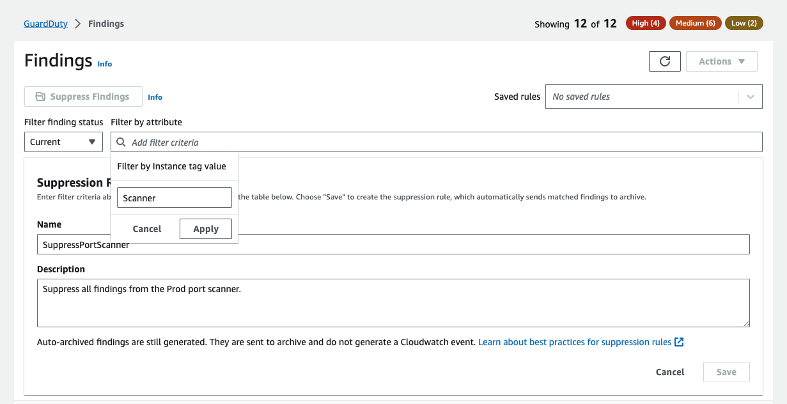

Suppression là một tập hợp các tiêu chí, bao gồm thuộc tính filter được ghép nối với một giá trị, được sử dụng để lọc các kết quả bằng cách tự động lưu trữ các finding mới phù hợp với tiêu chí đã chỉ định. Các suppression rules có thể được sử dụng để lọc các low-value filter, false positive findings hoặc các mối đe dọa mà bạn không có ý định xử lý, giúp dễ dàng nhận ra các mối đe dọa bảo mật có tác động lớn nhất đến môi trường của bạn.

Sau khi bạn tạo suppression rule, những finding mới phù hợp với tiêu chí được xác định trong quy tắc sẽ tự động được lưu trữ miễn là suppression rule vẫn còn hiệu lực. Bạn có thể sử dụng filter hiện có để tạo suppression rule hoặc suppression rule từ filter mới mà bạn xác định. Bạn có thể config các suppression rule để loại bỏ toàn bộ loại findings hoặc xác định tiêu chí filter chi tiết hơn để chỉ loại bỏ các trường hợp cụ thể của một loại finding cụ thể. Suppression rule của bạn có thể được chỉnh sửa bất kỳ lúc nào.

Các suppression findings sẽ không được gửi tới AWS Security Hub, Amazon S3, Detective hoặc CloudWatch, giúp giảm mức độ finding noise nếu bạn sử dụng các finding của GuardDuty thông qua Security Hub, third-party SIEM hoặc các ứng dụng cảnh báo và yêu cầu khác.

GuardDuty tiếp tục tạo ra các findings ngay cả khi chúng khớp với các suppression rules của bạn, tuy nhiên, những findings đó sẽ tự động được đánh dấu là đã lưu trữ. Kết quả được lưu trữ được lưu trữ trong GuardDuty trong 90 ngày và có thể được xem bất kỳ lúc nào trong khoảng thời gian đó. Bạn có thể xem các findings bị ẩn trong GuardDuty console bằng cách chọn **Archived** từ findings table hoặc thông qua API GuardDuty bằng cách sử dụng API ListFindings với tiêu chí FindingCriteria là service.archived bằng true.

{}
Ở môi trường multi-account chỉ có GuardDuty administrator có thể tạo suppression rules.
{}

Trong tình huống, chúng ta có một corporate server thực hiện quét các EC2 instances để tìm các open ports bằng nmap. Điều này tạo ra finding không mong muốn trong GuardDuty console, cách tốt nhất để giải quyết finding không mong muốn này là ngăn chặn finding đó. Server được xác định bằng tags "Name = Scanner" và "ENV = PROD".

#### Congfig rule để ngăn chặn finding không mong muốn

Ở trang **Findings**, click vào **Suppress Findings**. Tiếp theo, trong phần **Add filter criteria**, chọn **Instance Tag Value** và nhập **Scanner**.

{}
Trước khi lưu lại suppression rule, bạn có thể xem lại những findings sẽ được ngăn chặn ở cuối trang.
{}

Click vào nút **Apply**, nhập **SuppressPortScanner** ở **Name** field và nhập **Suppress all findings from the Prod port scanner.** ở **Description** field. Cuối cùng, click vào nút **Save**.

