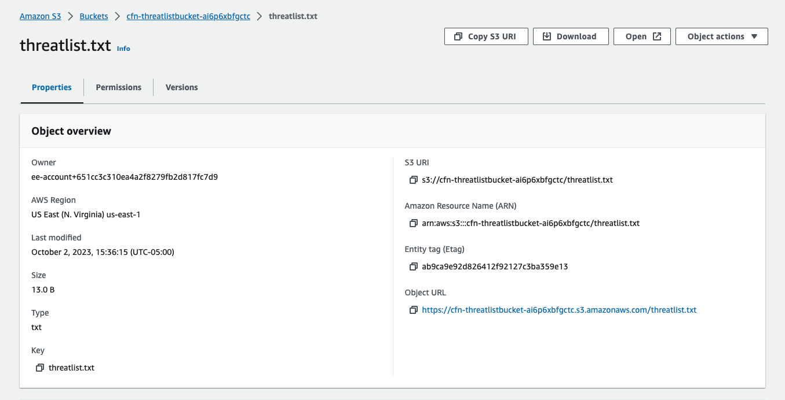
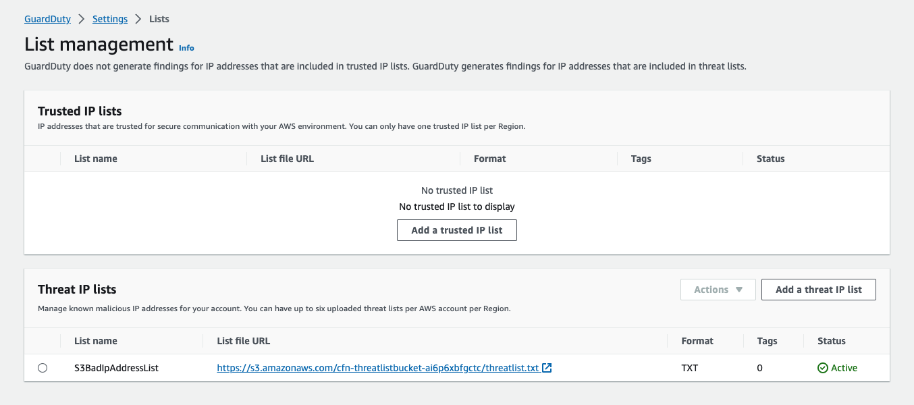
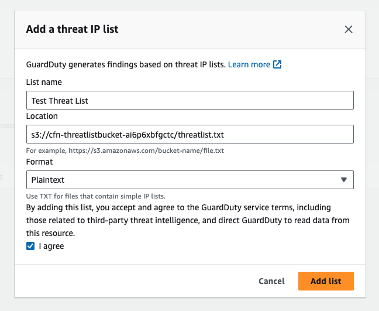
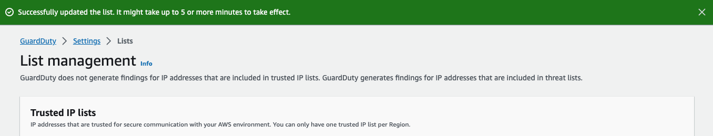

Amazon GuardDuty giám sát tính bảo mật của AWS environment của bạn bằng cách phân tích và xử lý VPC Flow Logs, AWS CloudTrail event logs và DNS logs. Bạn có thể tùy chỉnh phạm vi giám sát này bằng cách config GuardDuty để dừng cảnh báo cho các IP đáng tin cậy từ danh sách IP đáng tin cậy của riêng bạn và cảnh báo về các IP độc hại đã biết từ danh sách mối đe dọa của riêng bạn.

Trusted IP lists và threat list chỉ áp dụng cho lưu lượng truy cập dành cho các địa chỉ IP có thể định tuyến công khai. Hiệu ứng của danh sách áp dụng cho tất cả các VPC Flow Log và CloudTrail findings nhưng không áp dụng cho các DNS findings.

GuardDuty có thể được config để sử dụng các loại danh sách sau.

#### Trusted IP lists

Trusted IP lists bao gồm các địa chỉ IP mà bạn tin cậy để liên lạc an toàn với AWS infrastructure and applications của mình. GuardDuty không tạo ra các VPC Flow Log hoặc CloudTrail findings cho các địa chỉ IP trên trusted IP lists. Bạn có thể bao gồm tối đa 2000 địa chỉ IP và CIDR range trong một trusted IP list. Tại bất kỳ thời điểm nào, bạn chỉ có thể tải lên một trusted IP list cho mỗi tài khoản AWS ở mỗi Region.

#### Threat lists

Threat lists bao gồm các địa chỉ IP độc hại đã biết. Danh sách này có thể được cung cấp bởi thông tin về mối đe dọa của bên thứ ba hoặc được tạo riêng cho tổ chức của bạn. GuardDuty tạo ra các findings dựa trên threat lists. Bạn có thể bao gồm tối đa 250.000 địa chỉ IP và CIDR range trong một threat lists. GuardDuty chỉ tạo ra các findings dựa trên hoạt động liên quan đến địa chỉ IP và CIDR range trong threat lists của bạn, các findings sẽ không được tạo ra dựa trên domain names. Tại bất kỳ thời điểm nào, bạn có thể tải lên tối đa sáu threat lists cho mỗi tài khoản AWS cho mỗi Region.

Trong multi-account environments, chỉ người dùng từ tài khoản administrator GuardDuty mới có thể tải lên và quản lý trusted IP lists cũng như threat lists. trusted IP lists và threat lists do account administrator tải lên sẽ được áp dụng cho GuardDuty functionality account member của nó. Nói cách khác, trong account member, GuardDuty tạo ra các findings dựa trên hoạt động liên quan đến các địa chỉ IP độc hại đã biết từ threat lists của administrator và không tạo ra các findings dựa trên hoạt động liên quan đến địa chỉ IP từ trusted IP lists của administrator.

Để biết thêm thông tin về trusted IP lists và threat lists, [hãy đọc thêm thông tin ở đây](https://docs.aws.amazon.com/guardduty/latest/ug/guardduty_upload-lists.html)

Trong bài workshop này, chúng ta sẽ thêm một địa chỉ hư cấu vào threat lists.

#### Tạo file threat list

Bước đầu tiên là tạo một text file (ví dụ như "my-threat-list.txt") bằng Notepad. Text file này phải chứa một public IP duy nhất, hãy nhớ rằng các địa chỉ IP private không được hỗ trợ trong threat lists. Bạn hãy làm theo các bước dưới đây để tạo threat lists.

#### Upload file lên S3 bucket

Tiếp theo chúng ta hãy làm như dưới đây để upload threat list file lên S3 bucket. Đầu tiên hãy vào [S3 console](https://s3.console.aws.amazon.com/s3/buckets). Chọn S3 bucket đã được tạo trước đó sau đó click vào nút **Upload**. Trong trang **Upload**, click vào nút **Add files** và chọn file threat list đã tạo ở trên. Click vào nút **Upload** để upload file lên S3 bucket.

#### Thêm threat list vào GuardDuty

Bây giờ, chúng ta sẽ add threat list được tải lên S3 bucket vào GuardDuty. Đầu tiên, các bạn hãy vào [Amazon GuardDuty console](https://console.aws.amazon.com/guardduty). Ở phía bên trái chọn **Lists**, click vào nút **Add a threat IP list**.

Ở mục **List name**, nhập **Test Threat List**. Ở dưới là **Location**, chúng ta nhập **S3 URI** đã được tạo trước đó. Chọn **Format** là **Plaintext**. Tick vào **I agree** và cuối cùng là click vào nút **Add list**.

Chúc ta cần phải activate list mà chúng ta vừa add vào GuardDuty. Làm như sau, chọn list vừa tạo, click vào nút **Action** và chọn **Activate** trong thanh menu nhỏ. Khi thanh status hiện như dưới, bạn đã thành công.

