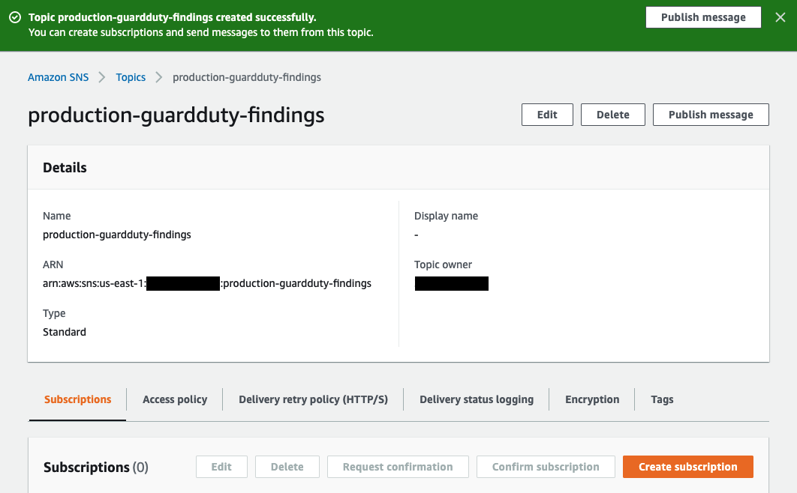
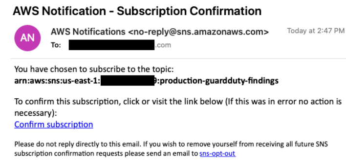
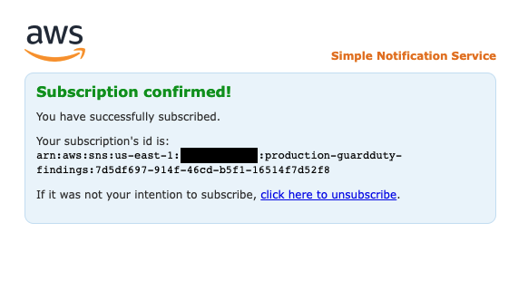

Amazon EventBridge là serverless event bus giúp xây dựng các ứng dụng event-driven trên quy mô lớn dễ dàng hơn bằng cách sử dụng các event được tạo từ AWS service. Ở phần trước, chúng ta đã tổng hợp các findings của GuardDuty bằng Security Hub. Trong phần này, chúng ta sẽ tạo EventBridge rule để tự động thông báo trên danh sách các findings được lọc mà chúng ta tổng hợp từ GuardDuty.

Amazon SNS là service quản lí các message cho cả application-to-application (A2A) và application-to-person (A2P). Chúng ta sẽ config SNS notifications (email notifications) khi chúng ta thấy GuardDuty findings ở mức độ MEDIUM hoặc HIGH.

{}
Bạn có thể assign metadata cho AWS resources của mình dưới dạng tags. Mỗi tag là một label bao gồm key và value do user xác định.
{}

#### Config Amazon SNS topic

Đầu tiên, các bạn hãy vào [Amazon SNS console](https://console.aws.amazon.com/sns/v3/home). Ở thanh điều hướng bên trái, click vào **Topics**, sau đó click vào **Create topic**. Chọn type **Standard**. Ở phần name, nhập **production-guardduty-findings**. Còn lại để mặc định, click vào nút **Create topic** ở cuối trang. Các bạn sẽ có kết quả như hình.



#### Subscribe topic

Từ trang topic **production-guardduty-findings**, chọn **Create subscription**. Ở trang **Create subscription**, ở dưới **Protocol**, chọn **email**. Tiếp theo, ở dưới phần **Endpoint**, nhập địa chỉ email mà bạn muốn dùng để nhận thông báo (Các bạn có thể unsubscribe ở cuối buổi). Và cuối cùng, click vào nút **Create subscription**. Kiểm tra lại email mà các bạn đã nhập, khoảng 2 phút, các bạn sẽ nhận được email.



Xác nhận subscription bằng cách click vào **Confirm subscription** ở trong email. Nó sẽ mở ra trang confirmation.



#### Tạo EventBridge rule để gửi findings đến topic

Bây giờ, chúng ta đã subscribe SNS topic, đã sẵn sàng gửi findings đến đó. Vì chúng ta đang sử dụng Security Hub để tổng hợp các findings từ các security services khác, bao gồm cả GuardDuty, nên chúng ta sẽ tạo EventBridge rule để theo dõi các event từ Security Hub. Để thực hiện việc này, chúng ta sẽ tạo Event Bridge. Chúng ta sẽ config SNS notifications (email notifications) khi chúng ta nhận được kết quả có mức nghiêm trọng MEDIUM hoặc HIGH từ EC2 instance có PROD tag.

Hãy làm như sau, đầu tiên chúng ta vào [Amazon EventBridge](https://console.aws.amazon.com/events/home), click vào nút **Create rule** ở phía bên phải. Ở trang **Define rule detail**, đặt tên cho rule đó là **production-guardduty-findings**. Tiếp theo click vào **Next**. Ở trang **Build event pattern**, cuộn xuống **Event pattern**, click vào nút **Edit pattern** ở góc trái và thêm phần event patter dạng JSON dưới đây.

```
{
  "source": ["aws.securityhub"],
  "detail": {
    "findings": {
      "ProductName": ["GuardDuty"],
      "Severity": {
        "Label": ["MEDIUM", "HIGH"]
      },
      "Resources": {
        "Type": ["AwsEc2Instance"],
        "Tags": {
          "ENV": ["PROD"]
        }
      }
    }
  }
}
```

Tiếp theo, click vào **Next**, ở trang **Select target(s)**, từ phần con, chọn **SNS topic**. Từ danh sách **Topic**, chúng ta chọn **production-guardduty-findings**. Tiếp theo, click **Next**, ở trang **Configure tags - optional**, click **Next**. Ở trang **Review and create**, click vào nut **Create rule**. Chúng ta đã tạo xong rule.


