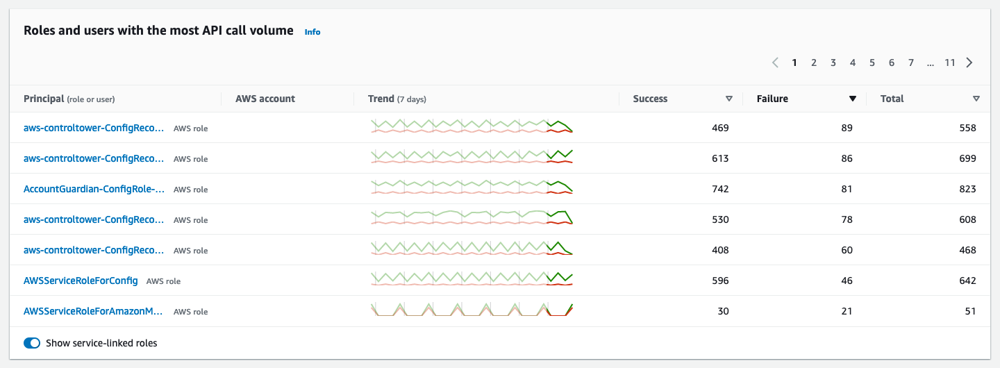
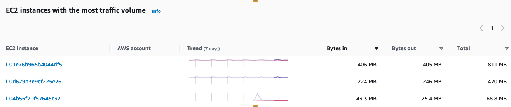

Amazon Detective cho phép bạn phân tích, điều tra và xác định nguyên nhân gốc rễ của các security findings hoặc hoạt động đáng ngờ. Detective thu thập các event dựa trên thời gian như số lần đăng nhập, API calls, network traffic từ AWS CloudTrail và Amazon VPC flow logs, các findings được nhập từ Amazon GuardDuty và Amazon EKS audit logs.

Amazon Detective truy xuất log data, sau đó implement machine learning, phân tích thống kê và lý thuyết đồ thị để tạo hình ảnh trực quan nhằm điều tra bảo mật nhanh chóng và hiệu quả. Các tập hợp, tóm tắt và bối cảnh dữ liệu được tạo sẵn có trong Detective cho phép bạn nhanh chóng phân tích và xác định bản chất cũng như mức độ bảo mật.

#### Amazon Detective

Đầu tiên, các bạn hãy vào [Amazon Detective](https://console.aws.amazon.com/detective). Chúng ta sẽ thấy 4 panels đó là:
- **Finding groups**: cho phép bạn phân tích nhiều hoạt động liên quán đến event xâm phạm bảo mật.
- **Roles and users with the most API Call volume**: cung cấp những users và roles có số lượng lệnh gọi API lớn nhất trong 24 giờ qua.
- **EC2 instances with the most traffic volume**: liệt kê các phiên bản EC2 có lưu lượng truy cập lớn nhất trong 24 giờ trước theo byte.
- **EKS clusters with the most Kubernetes pods created**
- **Newly observed Geolocations**: liệt kê các vị trí địa lý mà lệnh gọi API bắt nguồn trong 24 giờ trước đó nhưng lệnh gọi không bắt nguồn từ đó trong khoảng thời gian cơ sở.

#### Tương quan giữa suspicious activity (hoạt động đáng ngờ) và Findings Groups

Bạn có thể sử dụng các finding groups để trợ giúp cho việc điều tra của mình. Finding group của Amazon Detective cho phép bạn kiểm tra nhiều hoạt động liên quan đến một event xâm phạm bảo mật. Nếu kẻ đe dọa đang cố gắng xâm phạm AWS environment của bạn, chúng thường thực hiện một chuỗi hành động dẫn đến nhiều phát hiện bảo mật và hành vi bất thường. Những hành động này thường được trải rộng theo thời gian và các thực thể. Khi các phát hiện về bảo mật được điều tra riêng lẻ, điều này có thể dẫn đến hiểu sai về tầm quan trọng của chúng và gây khó khăn trong việc tìm ra nguyên nhân gốc rễ. Amazon Detective giải quyết vấn đề này bằng cách áp dụng kỹ thuật phân tích biểu đồ để suy ra mối quan hệ giữa các phát hiện và nhóm chúng lại với nhau. Chúng tôi khuyên bạn nên coi các finding groups là điểm khởi đầu để điều tra các thực thể và phát hiện có liên quan.

Detective phân tích dữ liệu từ các findings và nhóm chúng với các findings khác có khả năng liên quan dựa trên các resources mà chúng chia sẻ. Ví dụ: các findings được kích hoạt bởi các hành động được thực hiện bởi cùng các IAM role sessions hoặc bắt nguồn từ cùng một địa chỉ IP rất có thể là một phần của cùng một hoạt động cơ bản. Sẽ rất có giá trị khi điều tra các findings và bằng chứng theo nhóm ngay cả khi các mối liên hệ do Detective đưa ra không liên quan.

Ngoài các findings, mỗi nhóm bao gồm các thực thể có liên quan đến các findings đó. Các thực thể có thể bao gồm các resources bên ngoài AWS như IP Address hoặc tác nhân người dùng.

#### Điều tra dựa vào API call volume

Đầu tiên, các bạn vào [trang Detective summary](https://console.aws.amazon.com/detective). Panel thứ hai là danh sách users và roles có số lượng API calls nhiều nhất trong 24 giờ qua.

Mỗi phần cho bạn biết Principal (role/user), AWS account, weekly trend, number of successful API calls, number of failed API calls và total calls. Weekly trend cho phép bạn phân tích trực quan xem số lượng API calls trong 7 ngày qua có bất thường hay không, điều này cho phéo bạn dễ dàng phát hiện các xu hướng bất thường đối với từng principal.

#### Điều tra dựa vào lưu lượng truy cập EC2 instances

Đầu tiên, các bạn vào [trang Detective summary](https://console.aws.amazon.com/detective). Panel thứ ba thể hiện **EC2 instances with the most traffic volume** là danh sách các EC2 instance có lưu lượng truy cập cao nhất trong 24 giờ qua bằng bytes.

Mỗi phần cho bạn biết lưu lượng đi vào và đi ra trong 24 giờ cũng như timeline của lưu lượng truy cập đó trong 7 ngày. Việc xác định hành vi bất thường chẳng hạn như tăng đột biến trong trend có thể được ghi nhận là hoạt động đáng ngờ cần được điều tra.

#### Phân tích API origins

Đầu tiên, các bạn vào [trang Detective summary](https://console.aws.amazon.com/detective). Panel thứ tư là **Newly observed geolocations**. Panel này hiển thị vị trí địa lí nơi các API calls originated trong 24 giờ qua. Panel này cũng có thể chứa lên đến 100 vị trí, nó được highlight trên map và có thể chọn.

#### Search Capabilities

Nếu bạn muốn tìm kiếm thông qua Amazon Detective để tìm Amazon GuardDuty finding cụ thể bằng cách sử dụng kí tự đại diện hoặc mã định danh được đề xuất. Hãy làm như sau, đầu tiên các bạn hãy vào [Detective console](https://console.aws.amazon.com/detective/). Chọn **Search** ở thanh điều hướng. Ở dưới **Search**, chọn nút **Choose type** để chọn các loại entity hoặc resource mà bạn muốn tìm kiếm và nhập vào thanh tìm kiếm.

#### Amazon Detective Pricing

Detective pricing dựa trên data volume được nhập AWS CloudTrail logs, Amazon Virtual Private Cloud (Amazon VPC) Flow Logs, Amazon Elastic Kubernetes Service (Amazon EKS) audit logs và Amazon GuardDuty findings. Các khoản phí được tính trên mỗi Gigabyte (GB) được nạp vào mỗi account/region/month. Bạn sẽ không bị tính phí khi kích hoạt các log sources này để phân tích hoặc cho dữ liệu được lưu trữ trong Amazon Detective.

Bạn có thể dùng thử Amazon Detective miễn phí với bản dùng thử miễn phí 30 ngày. Bản dùng thử miễn phí cho phép bạn nhận được bộ tính năng Amazon Detective đầy đủ trong khoảng thời gian 30 ngày.

Để có được chi phí ước tính cho data volume đã nhập, đầu tiên, các bạn hãy vào [Detective console](https://console.aws.amazon.com/detective/). Click vào **Usage** trên thanh điều hướng, ở đây nó sẽ hiển thị chi phí trong khoảng thời gian 30 ngày của account được tính dựa vào source package.
