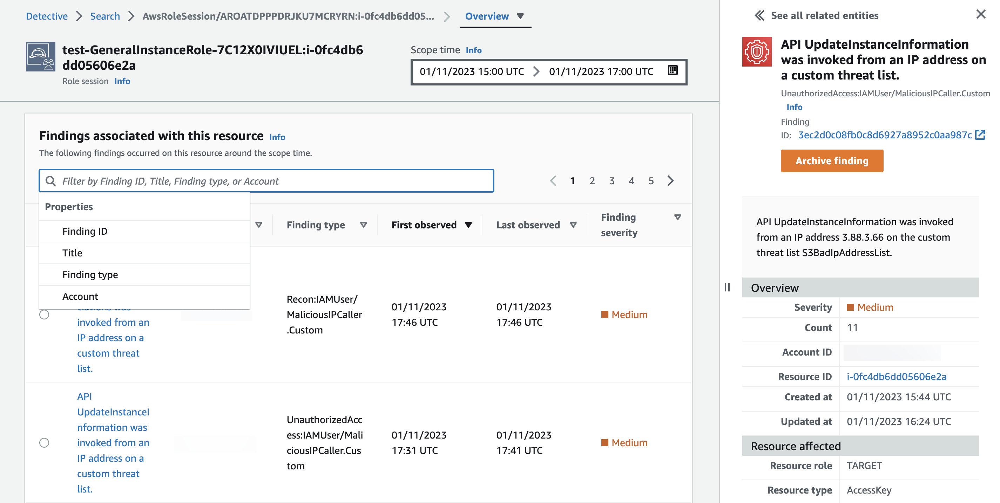

#### Điều tra compromised role session với Amazon Detective

Bạn hãy vào GuardDuty finding UnauthorizedAccess:IAMUser/MaliciousIPCaller.Custom và thực hiện remediate, bây giờ bạn sẽ điều tra thêm những gì đã xảy ra với resource này và tìm kiếm bất kỳ hoạt động đáng ngờ nào khác liên quan đến resource này hoặc bất kỳ hoạt động nào khác trong environment. Trong tình huống ứng phó sự cố, bạn sẽ có thể hành động khi bạn chắc chắn về những hành động cần thực hiện thường được xác định trong Incident Response playbooks (có thể sử dụng ví của playbooks). Đôi khi có thể cần đến Detective để xem xét một finding hoặc resource để xác định nên làm theo playbooks nào. Ví dụ: trong development environment, bạn có thể xóa resource nhanh hơn so với trong production environment có khả năng đưa ứng dụng trực tiếp vào trạng thái offline. Detective làm việc trong AWS Organization có thể giúp bạn điều tra tất cả các loại accounts và resources.

#### Pivot Detective Console

Đầu tiên, các bạn hãy vào [Amazon GuardDuty console](https://console.aws.amazon.com/guardduty). Sau đó chọn finding loại **UnauthorizedAccess:IAMUser/MaliciousIPCaller.Custom**. Ở phía trên bên phải, hãy click vào **Investigate with Detective**.

Ở phần nhỏ hiện ra sau khi click, chúng ta chọn **Role session**.

#### Chi tiết về Role session

Panel đầu tiên chúng ta thấy trong Role session entity là **Role session details**. Nó cung cấp cho bạn thông tin tổng quan về role session liên quan đến việc GuardDuty finding của chúng ta như associated account, assumed role among others.

Hãy nhìn khi role session được First observed và Last observed. Nó tương ứng như thế nào khi GuardDuty finidng lần đầu tiên được tạo ra và cập nhật? Thông tin này có thể giúp bạn thu hẹp time frame khi vai trò này bị xâm phạm.

Tiếp theo, bạn có thể muốn xác định xem đây có phải là IAM role được liên kết với production account hay không để xác định những gì bạn cần làm. Bạn có thể thực hiện việc này bằng cách tra cứu ID của AWS account trong configuration management database (CMBD) hoặc bất kỳ cách nào bạn tracking account, nhưng đối với tình huống này, hãy chọn **Assume role** để xem role được liên kết với session này.

Đi sâu vào role details trong Detective console hoặc chọn **AWS role** để xem thông tin role trong IAM console. Từ IAM role, bạn sẽ có thể xác định role có những quyền gì, có tags nào giúp bạn xác định role đó được sử dụng để làm gì hay không và cung cấp cho bạn direct pivot point từ Detective để thu hồi các sessions như bạn đã làm trước đó.

#### Những findings liên quan đến resource.

Nhìn vào phần **Findings associated with this resource**, bạn có thể tổng hợp các findings lại với nhau để hiểu rol này phù hợp như thế nào với vấn đề bảo mật tổng thể không?

Sử dụng search functionality để xem qua các finding. Nếu đây là admin account được ủy quyền của Detective, bạn có thể xem các findings trên nhiều accounts khác nhau như một data point để tiếp tục điều tra.

#### Tổng quan API call volume

Ở trang *Role sesion entity**, cuộn xuống panel **Overall API call volume**. Sau đó chọn **Display details for scope time** để mở rộng search window. Tiếp theo, hover vào horizontal line ở biểu dồ **Successful calls**. Cở sở cho các API calls thành công từ role session này là gì?

Tiếp theo, ở phía góc phải của panel **Overall API call volume** chọn **Edit time window**. Thay đổi scope time thành 24 hours trước khi GuardDuty finding được tạo ra mà set endtime là thời gian hiện tại. Nhìn vào thông tin để xác định **IP addresses** nào thực hiện API calls với role session và **API methods** nào được sử dụng. Tại thời điểm này, bạn có thể xem CloudTrail logs thông qua phương pháp truy vấn raw log data của mình, chẳng hạn như sử dụng Athena và Amazon Security Lake hoặc các giải pháp của đối tác bên thứ ba. Việc xem raw log data sẽ giúp bạn điều tra thêm chi tiết cụ thể về các API calls đã được thực hiện.

Trong tình huống này, chúng ta đã sử dụng Amazon Detective để tìm thông tin giúp chúng ta hiểu được role liên quan đến vấn đề bảo mật. Ví dụ chúng ta có thể xác định xem đây là role có elevated permissions hay role được liên kết với production account? Với thông tin này, bạn sẽ có thể xác định playbook nào cần tuân theo khi phản hồi và khắc phục resource này. Trong production environment có nhiều dữ liệu hơn, bạn sẽ có thể tận dụng Detective nhiều hơn nữa cho những việc như observer activity, resource interaction và traffic baselining.
