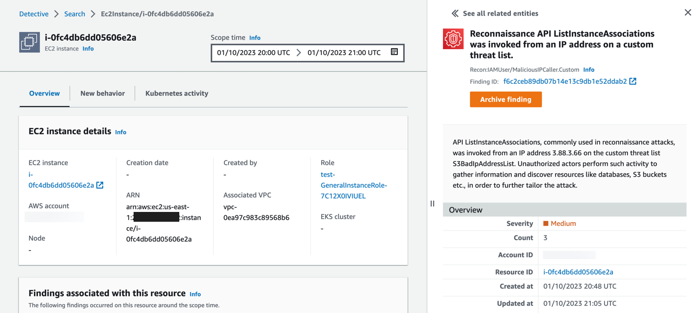
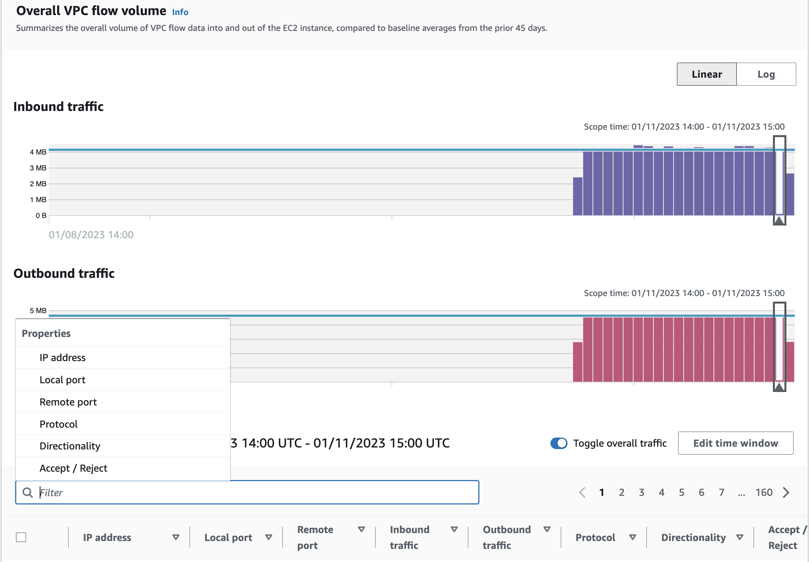
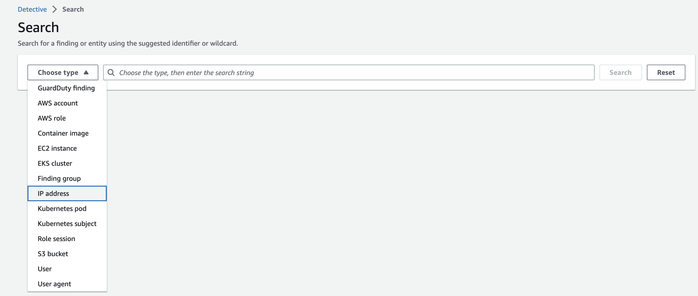
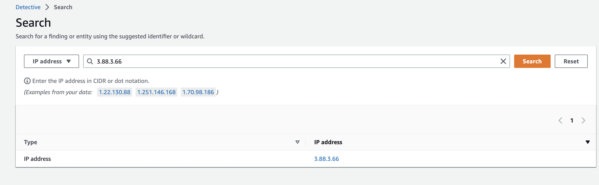

Khi có thể, việc khắc phục bạn sẽ được thực hiện tự động hóa hoàn toàn. Sau khi khắc phục resource liên quan đến finding của GuardDuty, bạn có thể điều tra và phân tích thêm tác động mà vấn đề bảo mật này có thể gây ra đối với các resource khác và đảm bảo rằng không cần khắc phục cái gì khác. Tiếp theo, chúng ta sẽ sử dụng Amazon Detective để tiến hành phân tích nguyên nhân cốt lõi nhằm xác định mức độ nghiêm trọng của vấn đề bảo mật. Detective cung cấp cho bạn thông tin về bảo mật về các resource có liên quan trong một environment nhất định mà không cần tạo ra các truy vấn phức tạp theo thời gian và phạm vi.

#### Pivot Detective Console

Đầu tiên, các bạn hãy vào [Amazon GuardDuty console](https://console.aws.amazon.com/guardduty). Sau đó chọn finding loại **UnauthorizedAccess:IAMUser/MaliciousIPCaller.Custom**. Ở phía trên bên phải, hãy click vào **Investigate with Detective**.

Trong tình huống này, chúng ta sẽ investigate EC2 instance liên quan đến GuardDuty finding, nhưng bạn sẽ nhận thấy rằng có một số tùy chọn khác nhau để pivot, chẳng hạn như chính GuardDuty finding, AWS account, session role, internal và external IP addresses. Chọn **EC2 instance** trong window mới được mở ra để investigate EC2 instance bị xâm phạm.

Bây giờ bạn sẽ được chuyển đến EC2 instance Detective profile liên quan đếnvGuardDuty finding ở trên. Như bạn có thể thấy, overall về finding của GuardDuty vẫn ở phía bên phải màn hình nên chúng ta có thể tiếp tục tham khảo khi cần tham khảo thông tin cụ thể liên quan đến finding đó.

Lưu ý rằng phạm vi thời gian để GuardDuty finding là từ khi event được thực hiện lần đầu tiên cho đến thời điểm event được GuardDuty thực hiện lần cuối. Cái này rất quan trọng vì scope time xác định data set mà Detective sẽ return cho bạn. Khi bạn làm bài workshop này, hãy thay đổi scope time sớm hơn và muộn hơn để xem liệu nó có thay đổi thông tin như các findings liên quan hoặc vị trí địa lý mới được quan sát hay không. Nếu bạn cần thêm thông tin về scope time, [hãy vào đây để tìm hiểu thêm về Detective](https://docs.aws.amazon.com/detective/latest/userguide/scope-time-managing.html).

#### Chi tiết về EC2 instance

Panel đầu tiên mà chúng tôi đã trình bày ở trang EC2 instance entity là **EC instance details**. Ở panel này, chúng ta sẽ tìm hieru thông tin tổng quan về EC2 instance liên kết với GuardDuty finding của chúng ta như **create date, VPC association và role among others**. Chúng ta có thể thấy những thông tin này được liên kết với nhau để chúng ta có thể pivot nó. Các bạn hãy chọn **Role**. Đây là role được gắn với EC2 instace. Các bạn sẽ thấy một cửa sổ mới có thông tin cụ thể về role entity mà bạn đã chọn. Xem qua thông tin về role và thu thập mọi bằng chứng quan trọng đối với bạn nếu bạn đang điều tra vấn đề bảo mật này. Quay trở lại trang EC2 instance entity. Đây là trang trước khi chúng ta pivot đến trang role entity.

Tiếp theo, chúng ta muốn xem những thông tin khác ma chúng ta có thể xác định về toàn bộ account. Hãy chọn **AWS acocunt hyperlink** trong panel **EC2 instance details**. Xem qua trang account entity và thu thập mọi bằng chứng quan trọng đối với ban nếu bạn đang điều tra vấn đề bảo mật này. Cuối cùng, hãy quay trở lại trang **EC2 instance entity** và tiếp tục phần tiếp theo.

#### Findings và VPC flow logs

Panel thứ hai trên trang profile **Findings associated with this entity** cho phép bạn suy luận xem có finding nào khác liên quan đến EC2 instance bị xâm phạm ngoài GuardDuty finding mà chúng ta hiện đang điều tra hay không. Finding profile sẽ liệt kê các địa chỉ IP, instance và account liên quan đến finding. Hãy xem xét các finding tổng hợp để xác định xem bức tranh tổng thể về vấn đề bảo mật có rõ ràng hơn hay không. Bạn có thể làm gì khi thấy những findings khác nhau? Tiếp theo, các bạn hãy cuộn xuống panel **Overall VPC flow volume**. **Activity for time window** sẽ tự động điều chỉnh thời gian theo scope time của cột và liệt kê địa chỉ IP, ports, lưu lượng truy cập vào và ra, protocol và notate xem lưu lượng truy cập được chấp nhận hay bị từ chối. Chọn **display details for scope time** ở cuối panel **Overall VPC flow volume**. Bây giờ bạn sẽ có khả năng filter VPC flow logs được liên kết với instance này như hình bên dưới.

Sử dụng filter functionality để tìm kiếm outbound DNS activity không liên kết với AWS managed DNS. Tiếp theo, chọn **Edit time window** và thay đổi thời gian nếu nó thay dổi VPC traffice baseline.

#### New behavior

Cuộn lên đầu trang **EC2 instance entity** và chọn tab **New behavior**. Trong tab này, Detective sẽ đưa ra một bức tranh về hoạt động nào là bình thường trong organizeation của bạn và hoạt động nào là bất thường. Tuy nhiên, để có được bức tranh hoàn chỉnh hơn, Detective cần truy cập dữ liệu ít nhất hai tuần. tăng trưởng của Detective analysis cũng tăng theo số lượng account trong behavior graph. Hai tuần đầu tiên sau khi bạn kích hoạt Detective được coi là traning period.

Cuộn qua các panels khác nhau để xác định thông tin nào bạn có thể thu thập liên quan đến việc điều tra vấn đề bảo mật.

#### Search

Ở đây, bạn hãy mở detail của GuardDuty finding ở phía bên phải màn hình. Hãy lưu ý **IP address** trong phần **Actor** của fnding details. Khi bạn có địa chỉ IP của tác nhân được liên kết với GuardDuty finding, hãy chọn **Search** ở thanh điều hướng ở bên trái.

Click vào **Choose type** ở menu nhỏ. Chọn **IP address** trong phần **Choose type**. Nhập địa chỉ IP mà bạn đã note lại từ GuardDuty finding details ở trên và chọn **Search** ở bên phải màn hình. Chọn **IP address hyperlink** để điều hướng đến trang **IP address entity**.

Khi bạn ở trên trang **IP address entity**, hãy lướt qua các panel khác nhau để thu thập thông tin về địa chỉ IP được liên kết với tác nhân:
- Lần đầu tiên và lần cuối cùng nó được nhìn thấy là khi nào?
- Tác nhân này có liên quan đến các finding khác nhau của GuardDuty trong môi trường này không?

Cuộn lên đầu trang **IP address entity** và chọn tab **Resource interaction**. Trong tab **Resource interaction**, chúng ta có thể xem được roles, users và AWS accounts nào mà địa chỉ IP này đã tương tác trong scope time. Nếu bạn thay đổi scope time thì có thay đổi panel resource interaction không?

Trong tình huống này, chúng ta đã sử dụng Amazon Detective để tìm thông tin giúp chúng ta điều tra sự cố bảo mật với dữ liệu khá hạn chế. Trong production environment có nhiều dữ liệu hơn, bạn sẽ có thể tận dụng Detective nhiều hơn nữa cho những việc như observed activity, resource interaction và traffic baselining. Bạn đã sử dụng Amazon Detective để thu thập thêm thông tin về mức độ của sự cố bảo mật và các resources liên quan, bạn sẽ hiểu rõ hơn về các resources khác cần được khắc phục, các permissions cần được xác định phạm vi và nguyên nhân gốc rễ thông tin phân tích để đưa vào các báo cáo sau khi thực hiện, cùng nhiều thông tin khác.